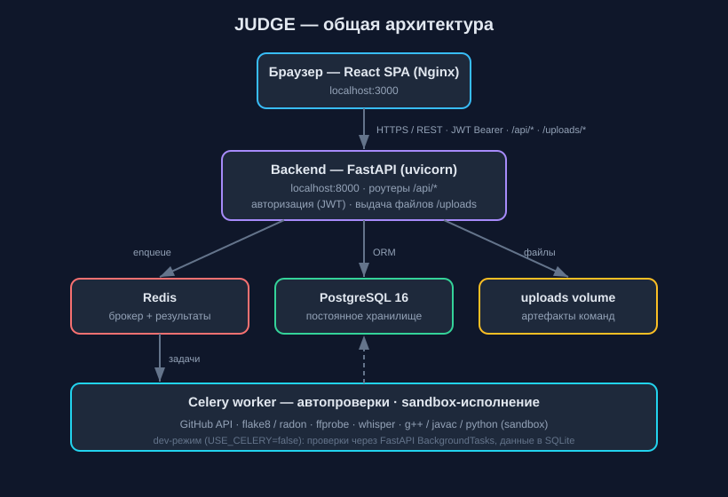
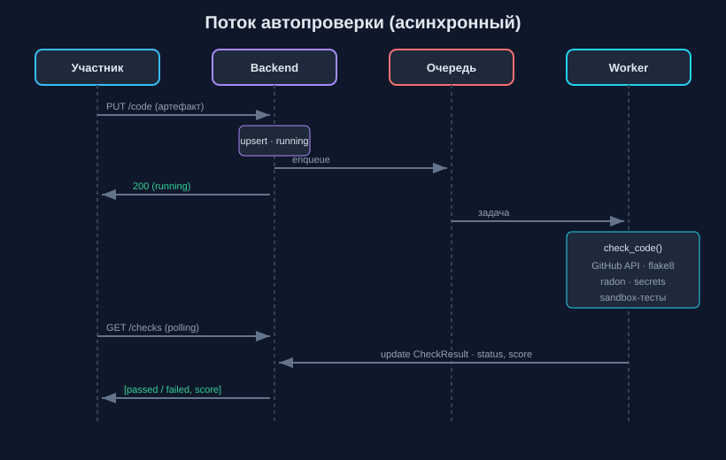
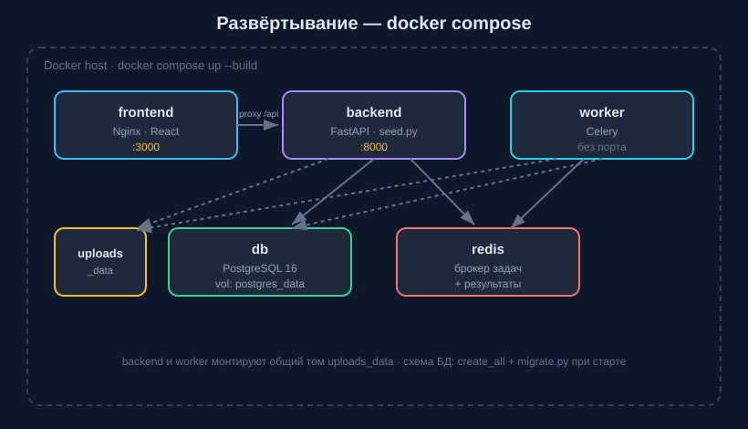

# Архитектура JUDGE

Документ описывает устройство сервиса автоматического учёта и оценки решений
команд на хакатоне: компоненты, модель данных, API, потоки автопроверок,
безопасность, развёртывание и эксплуатацию.

---

## 1. Описание системы (обзор)

JUDGE — веб-сервис, который принимает артефакты команд (репозиторий, документация,
презентация, скринкаст, алгоритмические решения), выполняет автоматические
формальные проверки в фоне, предоставляет жюри панель экспертной оценки по
настраиваемым критериям и строит итоговый рейтинг команд.

Система разделена на **frontend** (SPA) и **backend** (REST API). Долгие проверки
выполняются асинхронно в **очереди задач**. Данные хранятся в **реляционной СУБД**.

---

## 2. Компоненты и их взаимодействие



*Рис. 1. Общая архитектура: SPA → FastAPI → Redis / PostgreSQL / uploads → Celery worker.*

```
                         ┌─────────────────────────────┐
                         │   Браузер (React SPA, Nginx) │
                         │   localhost:3000             │
                         └──────────────┬──────────────┘
                                        │ HTTPS/REST (JWT Bearer)
                                        │ /api/*, /uploads/*
                         ┌──────────────▼──────────────┐
                         │  Backend — FastAPI (uvicorn) │
                         │  localhost:8000              │
                         │  · роутеры /api/*            │
                         │  · авторизация (JWT)         │
                         │  · выдача файлов /uploads     │
                         └───┬───────────┬───────────┬──┘
                             │           │           │
              enqueue задач  │           │ ORM       │ статические
                             │           │           │ файлы
                   ┌─────────▼──┐   ┌────▼─────┐  ┌──▼────────────┐
                   │   Redis    │   │ Postgres │  │ uploads volume │
                   │ (брокер +  │   │   16     │  │ (артефакты)    │
                   │  результат)│   └────▲─────┘  └────────────────┘
                   └─────┬──────┘        │ ORM
                         │ задачи        │
                   ┌─────▼───────────────┴────┐
                   │  Celery worker            │
                   │  · автопроверки           │
                   │  · sandbox-исполнение     │
                   │  · внешние инструменты    │
                   └───────────────────────────┘
                       │        │        │
                  GitHub API  ffprobe  g++/javac/python
                  flake8/radon  whisper   (sandbox)
```

**Сервисы `docker compose`:**

| Сервис | Порт | Роль |
|--------|------|------|
| `frontend` | 3000 | React-приложение, раздаётся Nginx; проксирует `/api` и `/uploads` на backend |
| `backend` | 8000 | FastAPI: REST API, авторизация, выдача файлов; при старте выполняет `seed.py` |
| `worker` | — | Celery-воркер: обрабатывает задачи автопроверок и sandbox |
| `db` | — | PostgreSQL 16, постоянное хранилище (`postgres_data`) |
| `redis` | — | Брокер задач и backend результатов Celery |

> В dev-режиме (`USE_CELERY=false`) воркер и Redis не нужны: проверки выполняются
> через `FastAPI BackgroundTasks` в процессе backend, а данные — в SQLite.

---

## 3. Технологический стек

**Backend:** Python 3.12, FastAPI, SQLAlchemy 2, Pydantic v2, Celery, Redis,
PostgreSQL / SQLite, JWT (python-jose), bcrypt (passlib).

**Frontend:** TypeScript, React 18, Vite, Tailwind CSS v4, Radix UI, Recharts,
Framer Motion, react-router.

**Инструменты автопроверок:** GitHub REST API, `git`, flake8, radon, PyPDF2,
python-docx, python-pptx, ffmpeg/ffprobe, опционально openai-whisper.

---

## 4. Модель данных

```
User ──< TeamMember >── Team ──> Case
 │  (jury)                │
 │                        ├──1:1── Submission ──< CheckResult
 │                        │
 └──< Evaluation >────────┘
            │
            └──< CriterionScore >── Criterion

ChecklistItem            (настраиваемые разделы docs / presentation)

AlgoProblem ──< AlgoTestCase
     │
     └──< AlgoSubmission >── User
```

| Таблица | Назначение | Ключевые поля |
|---------|-----------|---------------|
| `users` | Пользователи и роли | `email`, `password_hash`, `role` (participant/jury/organizer) |
| `cases` | Кейсы (треки) хакатона | `slug`, `title`, `sponsor` |
| `teams` | Команды | `name`, `join_code`, `case_id` |
| `team_members` | Состав команд | PK (`team_id`, `user_id`), `is_leader` |
| `submissions` | Заявка команды (1:1 к команде) | пути/имена артефактов, `repo_url`, `transcript` |
| `check_results` | Результаты автопроверок | `check_type`, `status`, `score`, `details` (JSON) |
| `criteria` | Критерии оценки | `name`, `weight`, `max_score`, `position` |
| `evaluations` | Оценка команды членом жюри | `team_id`, `jury_id`, `score` (0–50), `comment` |
| `criterion_scores` | Балл по критерию внутри оценки | `evaluation_id`, `criterion_id`, `score` |
| `checklist_items` | Настраиваемые разделы артефактов | `kind` (docs/presentation), `keyword`, `label` |
| `algo_problems` | Алгоритмические задачи | `statement`, `time_limit_ms`, `memory_limit_mb` |
| `algo_test_cases` | Тесты задач | `input_data`, `expected_output`, `is_sample` |
| `algo_submissions` | Попытки участников | `language`, `verdict`, `score`, `test_results` (JSON) |

**Миграции.** `Base.metadata.create_all` создаёт недостающие таблицы, а
`app/migrate.py` при старте добавляет недостающие колонки в существующие таблицы
(идемпотентно, работает для SQLite и PostgreSQL). Это позволяет обновлять схему
без потери уже накопленных данных.

---

## 5. REST API (основные группы)

Все защищённые эндпоинты требуют заголовок `Authorization: Bearer <JWT>`.
Полная интерактивная спецификация — Swagger UI на `http://localhost:8000/docs`.

| Префикс | Назначение | Доступ |
|---------|-----------|--------|
| `/api/auth` | регистрация, вход, профиль, аватар | публичный / по токену |
| `/api/teams` | команды: создание, вступление, состав, карточка | участник / жюри / организатор |
| `/api/submissions` | загрузка артефактов, статусы проверок, скачивание | участник / жюри / организатор |
| `/api/criteria` | критерии оценки (CRUD) | чтение — все, запись — организатор |
| `/api/checklist` | настраиваемые разделы docs/presentation (CRUD) | чтение — все, запись — организатор |
| `/api/evaluations` | список команд для жюри, выставление оценок | жюри |
| `/api/leaderboard` | итоговый рейтинг | по токену |
| `/api/cases` | кейсы (CRUD) | чтение — все, запись — организатор |
| `/api/analytics` | сводная аналитика, уведомления, экспорт CSV | организатор / жюри |
| `/api/algo` | задачи, тесты, отправка и проверка решений | по роли |

**Роли и права.** Доступ к привилегированным операциям контролируется зависимостью
`require_role(...)` на стороне backend. Публичная регистрация всегда создаёт роль
`participant` — повысить себя до жюри/организатора через API нельзя; такие учётные
записи создаются через `seed.py` (или будущий организаторский эндпоинт).

---

## 6. Потоки автопроверок

Общий принцип: загрузка артефакта создаёт/обновляет `CheckResult` со статусом
`running` и **ставит фоновую задачу**; ответ участнику возвращается сразу. Фронт
опрашивает `/api/submissions/checks` до перехода всех проверок в `passed`/`failed`.



*Рис. 2. Последовательность: загрузка → постановка в очередь → фоновая проверка → опрос статуса.*

```
Участник            Backend                  Очередь            Worker
   │  PUT /code        │                        │                  │
   ├──────────────────>│ upsert CheckResult     │                  │
   │                   │ status=running         │                  │
   │                   ├── enqueue ────────────>│                  │
   │<── 200 (running) ─┤                        ├── задача ───────>│
   │                   │                        │      check_code()│
   │  GET /checks      │                        │      (GitHub API,│
   ├──────────────────>│                        │       flake8,    │
   │<── [running] ─────┤                        │       radon,     │
   │       ...         │                        │       secrets)   │
   │  GET /checks      │                        │      сохранить   │
   ├──────────────────>│<───────── update CheckResult ────────────┤
   │<── [passed,score]─┤                        │   status,score   │
```

**Виды проверок (`backend/app/checks/`):**

- **code** (`code_checker.py`) — структура репозитория (README, лицензия, файл
  зависимостей, инструкции запуска, `.gitignore`), LOC, flake8, сложность (radon),
  поиск секретов; опционально запуск тестов команды в песочнице (`RUN_TEAM_TESTS`).
  Источник кода — GitHub API по `repo_url` либо распакованный ZIP-архив.
- **docs** (`doc_checker.py`) — извлечение текста (PDF/DOCX/MD), наличие
  обязательных разделов (**из `checklist_items`**), объём, изображения/схемы.
- **presentation** (`pptx_checker.py`) — число слайдов и ключевые темы
  (**из `checklist_items`**) для PPTX/PDF.
- **screencast** (`video_checker.py`) — `ffprobe`: длительность, разрешение, кодек,
  наличие аудио; опционально транскрипция и саммари (Whisper). Ссылка на
  видеохостинг помечается для ручного просмотра.

`runner.py` — общий слой: открывает собственную сессию БД, вызывает нужный
чекер, сохраняет результат. Не зависит от FastAPI, поэтому одинаково работает и
в Celery-воркере, и в `BackgroundTasks`.

### Алгоритмический модуль

`run_algo_judge` (через `sandbox.py`) компилирует решение (Python/C++/Java) и
прогоняет его по всем тестам задачи, сравнивая вывод с эталоном. Вердикты:
**OK / WA / TL / ML / RE / CE**. Балл = доля пройденных тестов; сохраняются время
и подробности по каждому тесту. Участникам в условии задачи видны только тесты с
`is_sample=true` — скрытые тесты не утекают.

---

## 7. Очередь задач

`queue.py` выбирает механизм исполнения по флагу `USE_CELERY`:

- `true` — задача публикуется в Redis, обрабатывается Celery-воркером (прод);
- `false` — задача исполняется через `FastAPI BackgroundTasks` в том же процессе
  (dev, без внешних зависимостей).

Сигнатуры задач идентичны, поэтому остальной код не зависит от выбора. Долгие
операции (клонирование/анализ репозитория, обработка видео, sandbox-проверки) не
блокируют HTTP-ответ.

---

## 8. Песочница и безопасность

- **Пароли** хешируются bcrypt (passlib); в БД хранится только хеш.
- **Аутентификация** — JWT с временем жизни; подпись секретом `SECRET_KEY`.
- **Разграничение прав** по ролям через `require_role` на каждом защищённом
  эндпоинте; публичная регистрация не позволяет получить привилегированную роль.
- **Загрузка файлов** — проверка расширения по whitelist для каждого типа
  артефакта, лимиты размера (архивы — 100 МБ, прочие — 200 МБ, аватар — 5 МБ).
  Расширение аватара определяется по проверенному MIME, SVG запрещён
  (защита от stored XSS при выдаче с нашего origin).
- **Sandbox-исполнение** алгоритмических решений и тестов команды — в отдельном
  процессе с лимитом по времени и ограничением памяти (RLIMIT на Linux). 
  ⚠️ Песочницу следует запускать только внутри контейнера-воркера (Linux); для
  продакшена рекомендуется усиление — отдельный контейнер с cgroup-лимитами
  памяти и `--network=none`.

---

## 9. Развёртывание



*Рис. 3. Сервисы docker compose: frontend, backend, worker, db, redis и тома данных.*

**Требование:** установленный Docker.

```bash
cp .env.example .env       # при необходимости отредактировать секреты
docker compose up --build
```

Поднимаются все пять сервисов; backend при старте выполняет `seed.py` и
загружает демо-данные. Доступ:

| Что | Адрес |
|-----|-------|
| Веб-интерфейс | http://localhost:3000 |
| API | http://localhost:8000 |
| Swagger UI | http://localhost:8000/docs |

**Ключевые переменные окружения** (`.env`, см. также `backend/app/config.py`):

| Переменная | Назначение |
|------------|-----------|
| `DATABASE_URL` | строка подключения к СУБД |
| `SECRET_KEY` | ключ подписи JWT (**обязательно сменить в проде**) |
| `USE_CELERY` | `true` — очередь Celery/Redis, `false` — в процессе |
| `CELERY_BROKER_URL` / `CELERY_RESULT_BACKEND` | адреса Redis |
| `RUN_TEAM_TESTS` | запускать ли тесты команды при проверке кода |
| `ALLOWED_ORIGINS` | список разрешённых origin для CORS |
| `POSTGRES_USER` / `POSTGRES_PASSWORD` / `POSTGRES_DB` | параметры БД |

---

## 10. Эксплуатация

- **Логи:** `docker compose logs -f backend` (или `worker`, `frontend`).
- **Статус:** `docker compose ps` — все сервисы должны быть `Up`/`healthy`.
- **Перезапуск компонента:** `docker compose restart backend worker`.
- **Повторная загрузка демо-данных:** `docker compose exec backend python seed.py`
  (идемпотентно — существующие записи не дублируются).
- **Доступ к БД:** `docker compose exec db psql -U judge -d judge`.
- **Резервная копия БД:** `docker compose exec db pg_dump -U judge judge > backup.sql`.
- **Хранилище артефактов** — том `uploads_data` (монтируется в backend и worker);
  включать в резервное копирование вместе с БД.
- **Обновление схемы** — при старте автоматически (`create_all` + `migrate.py`),
  ручные миграции не требуются.

---

## 11. Структура репозитория

```
backend/
  app/
    routers/      auth, teams, submissions, evaluations, leaderboard,
                  algo, cases, criteria, checklist, analytics
    checks/       code_checker, doc_checker, pptx_checker, video_checker,
                  sandbox, runner
    models.py     модели БД (SQLAlchemy)
    schemas.py    схемы запросов/ответов (Pydantic)
    config.py     настройки и переменные окружения
    migrate.py    авто-добавление колонок при старте
    celery_app.py приложение Celery
    queue.py      выбор очереди: Celery или BackgroundTasks
  seed.py         демо-данные
frontend/
  src/app/
    pages/        страницы (дашборды, рейтинг, карточка команды, управление…)
    components/    UI-компоненты и общий layout
    context/       контекст авторизации
    lib/           API-клиент
docker-compose.yml
```

